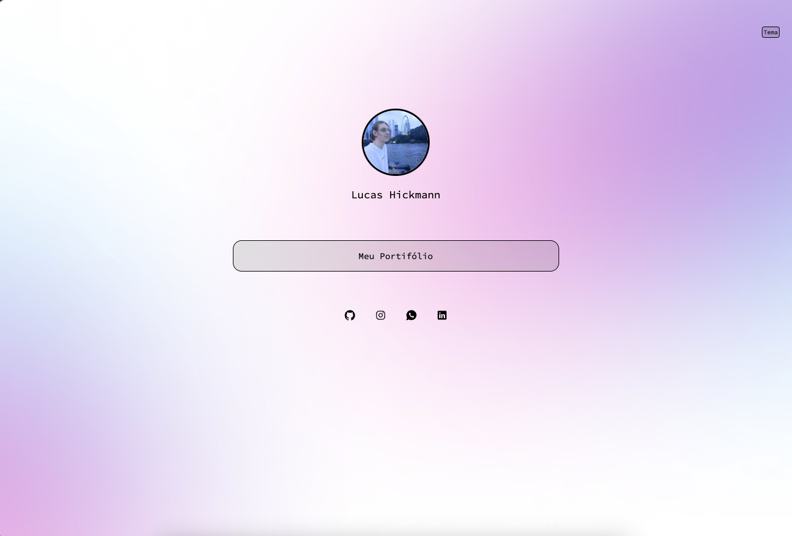

<h1 align=center>Meu Primeiro Site</h1>

O Projeto é um site aonde conto um pouco sobre mim, e disponibizo minhas redes sociais para entrar em contato.

Aprendi muito com esse projeto, estou facinado com o mundo da programação, quando as pessoas falavam que esse mundo não tem limites eu não acreditava. 
Estou amando aprender sobre e desejo muito em breve poder estar atuando na área como um profissional

Este projeto foi desenvolvido com as seguintes tecnologias: 
  * HTML  
  * CSS  
  * JAVASCRIPT  
  * GIT E GITHUB

